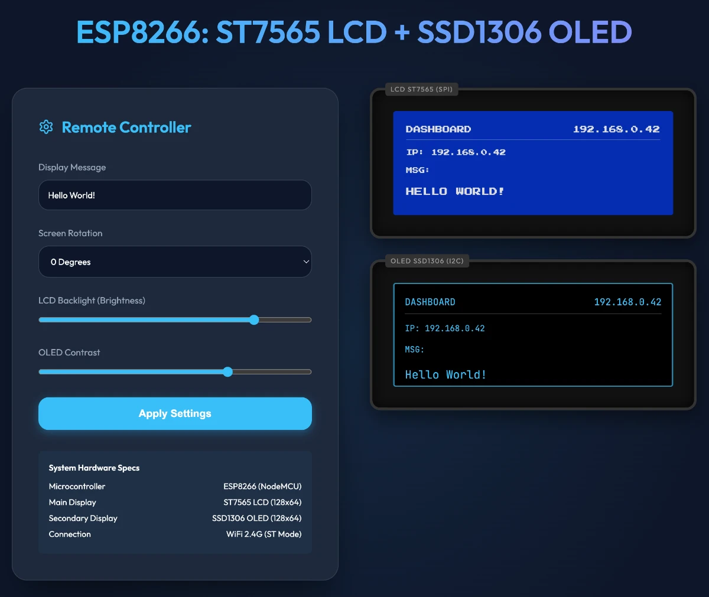
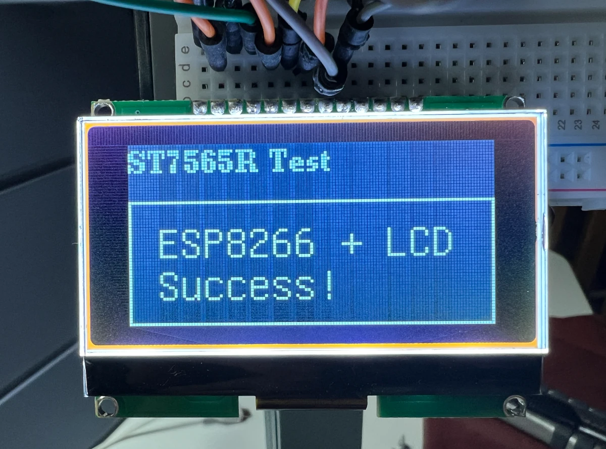
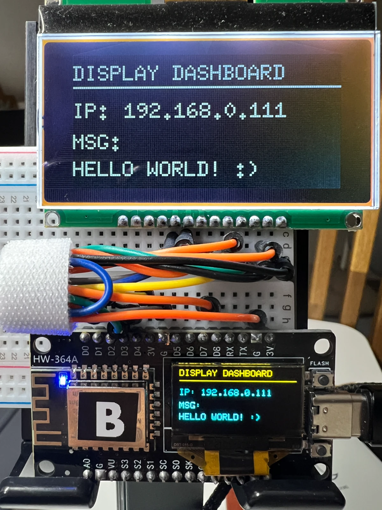

# ESP8266 ST7565 & SSD1306 Dual Display Web Control

ESP8266을 사용하여 ST7565 LCD와 SSD1306 OLED 디스플레이를 동시에 제어하고, 웹 대시보드를 통해 실시간으로 상태를 관리할 수 있는 프로젝트입니다.

---

## 📸 프로젝트 스크린샷

| 웨이크업 / 연결 상태 | 웹 대시보드 인터페이스 | 실제 하드웨어 구동 |
| :---: | :---: | :---: |
|  |  |  |

> **회로 연결도:**
> 

---

## ✨ 주요 기능

- **듀얼 디스플레이 동기화**: ST7565 (Graphic LCD)와 SSD1306 (OLED)에 동일한 정보 또는 독립적인 정보 표시
- **웹 기반 제어 (Web Dashboard)**: 브라우저를 통해 어디서든 디스플레이 메시지, 회전, 밝기 조정 가능
- **실시간 설정 변경**:
  - 디스플레이 텍스트 입력 및 전송
  - 화면 회전 제어 (0, 90, 180, 270도)
  - ST7565 백라이트 밝기 조정 (PWM)
  - SSD1306 OLED 명암(Contrast) 조정
- **반응형 대시보드**: 모바일에서도 편리하게 제어 가능한 모던한 UI 적용

---

## 🛠 하드웨어 설정 (Pin Mapping)

ESP8266 (NodeMCU/Wemos D1 Mini) 기준 연결 정보입니다.

### 1. ST7565 LCD (SPI)
| LCD Pin | ESP8266 Pin (GPIO) | 설명 |
| :--- | :--- | :--- |
| **CLK** | GPIO 0 (D3) | 시리얼 클럭 |
| **DATA** | GPIO 13 (D7) | 시리얼 데이터 (MOSI) |
| **CS** | GPIO 16 (D0) | Chip Select |
| **DC** | GPIO 4 (D2) | Data/Command |
| **RST** | GPIO 5 (D1) | Reset |
| **LED** | GPIO 2 (D4) | 백라이트 제어 (AnalogWrite) |

### 2. SSD1306 OLED (I2C)
| OLED Pin | ESP8266 Pin (GPIO) | 설명 |
| :--- | :--- | :--- |
| **SDA** | GPIO 14 (D5) | I2C Data |
| **SCL** | GPIO 12 (D6) | I2C Clock |

---

## 📚 소프트웨어 의존성

Arduino IDE의 라이브러리 관리자에서 다음 라이브러리들을 설치해야 합니다.

- **U8g2**: ST7565 LCD 제어용
- **Adafruit SSD1306**: OLED 제어용
- **Adafruit GFX**: 그래픽 유틸리티
- **ESP8266WiFi / ESP8266WebServer**: WiFi 및 웹 서버 구동용 (ESP8266 코어 기본 포함)

---

## 🔒 보안 강화 가이드 (Security Recommendations)

현재 소스 코드에는 WiFi SSID와 비밀번호가 하드코딩되어 있습니다. GitHub 등에 업로드하기 전에 다음 과정을 거치는 것을 강력히 권장합니다.

1.  **자격 증명 분리**: `secrets.h` 또는 `config.h` 파일을 생성하여 WiFi 정보를 관리하세요.
2.  **`.gitignore` 사용**: 비밀번호가 포함된 파일을 Git 추적에서 제외하세요.
3.  **웹 페이지 인증**: 필요 시 웹 서버(handleRoot)에 간단한 HTTP Basic Auth를 추가하여 외부 접근을 제한하세요.

---

## 🚀 시작하기

1.  `.ino` 파일을 Arduino IDE에서 엽니다.
2.  사용 중인 ESP8266 보드(NodeMCU 1.0 등)를 선택합니다.
3.  개발자의 WiFi 환경에 맞게 `ssid`와 `password` 변수를 수정합니다.
4.  업로드를 완료한 후 Serial Monitor(115200 baud)에서 할당된 IP 주소를 확인합니다.
5.  브라우저에서 해당 IP로 접속하여 디스플레이를 제어합니다.
